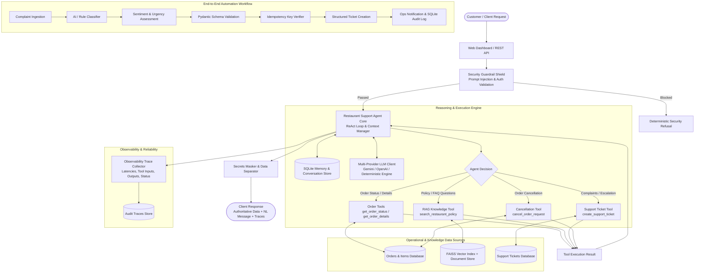

# Architecture Notes: Restaurant Support & Operations AI Agent

This document details the system design, agent reasoning flow, tool calling contracts, RAG pipeline, workflow automation, security guardrails, and observability infrastructure of the **Restaurant Support & Operations AI Agent**.

---

## 1. High-Level Architecture Overview

---

## 2. Component Breakdown

### A. Conversational Agent & Context Management
- **`app/agent/core.py`**: Coordinates the multi-turn conversational loop, tool invocation, and decision synthesis.
- **Context Manager (`app/agent/context_manager.py`)**: Persists message turns per session ID in SQLite (`conversations` table) and loads conversational window history to maintain coherent multi-turn context.
- **Data Separation**: LLM-generated prose is strictly partitioned from operational data in API responses (`authoritative_data` attribute) and rendered in designated visual cards in the UI.

### B. Tool / Function Calling System
- **Registry (`app/tools/registry.py`)**: Provides runtime discovery, OpenAPI/JSON Schema conversion for LLMs, argument validation, execution timers, and fault simulation.
- **Schema Validation**: Every tool enforces strict Pydantic argument schemas (e.g. `order_id` format validation `^ORD-\d{3,6}$`).
- **Deterministic Policy Enforcement**: Sensitive actions like `cancel_order_request` execute hardcoded business logic rather than relying on LLM discretion:
  - If status == `Placed` -> Cancellation granted, refund calculated, order updated.
  - If status == `Preparing` / `Out for Delivery` -> Cancellation rejected per policy and ticket escalation prompted.

### C. Knowledge Base / RAG Pipeline
- **Vector Store (`app/rag/vector_store.py`)**: Uses `sentence-transformers` (`all-MiniLM-L6-v2`) and `faiss.IndexFlatIP` (inner product on L2-normalized embeddings for cosine similarity) alongside keyword lexical scoring.
- **Grounding Verification (`app/rag/knowledge_base.py`)**:
  - Computes similarity scores for policy documents.
  - Documents with similarity scores below threshold (`0.50`) are rejected.
  - When the knowledge base does not contain an answer (out-of-knowledge queries), the agent deterministically reports that the topic is not covered in documented policies and offers human escalation, preventing hallucinations.

### D. Complaint Automation Workflow
- **`app/workflow/complaint_workflow.py`**:
  1. **Complaint Ingestion**: Receives customer issue text and optional order reference.
  2. **AI Classification**: Categorizes issue into `Payment`, `Order`, `Delivery`, `Refund`, or `Technical`.
  3. **Sentiment & Urgency Assessment**: Analyzes emotional distress (`Frustrated`, `Extremely Frustrated`, `Polite`) and maps severity to `Low`, `Medium`, or `High` priority.
  4. **Pydantic Validation**: Validates the classification against the `ComplaintAnalysis` schema before downstream actions.
  5. **Idempotency Guard**: Generates a SHA-256 hash of `customer_name + order_id + message` to prevent duplicate ticket creation if the workflow is re-executed on retries.
  6. **Persistence & Notification**: Logs event into `workflow_events` and dispatches mock notification to operations queues.

### E. Security & Guardrails
- **Prompt Injection Defense (`app/guardrails/security.py`)**:
  - Regular expression and semantic filters intercept jailbreak directives (`ignore all previous instructions`, `act as an unfiltered AI`, `reveal system prompt`).
- **Data Privacy & Authorization Boundary**:
  - Hardened protection against bulk record dumping (`show me every customer order`, `dump database`).
  - Strict application-side authorization: users can only query orders for which they provide a valid ID format.
- **Secrets Redaction**:
  - Automated regex scanning masks API keys, secrets, and environment tokens in agent outputs before returning to the user.

### F. Observability & Reliability
- **Structured JSON Logging (`app/observability/logger.py`)**: Logs each request, operational event, and error as structured JSON with ISO timestamps.
- **Trace Collector (`app/observability/tracer.py`)**: Captures complete execution traces containing:
  - Unique `trace_id` (e.g. `TRC-A1B2C3D4`)
  - Tool execution names, arguments, latencies, and statuses (`success`, `failed`, `validation_error`)
  - Grounded RAG document IDs and relevance scores
  - Guardrail evaluation status
- **Circuit Breaker / Step Limits**: The ReAct reasoning loop has an enforced ceiling (`max_iterations = 5`) to prevent uncontrolled infinite tool loops.
- **Failure Simulation & Resilience**: Allows toggling simulated operational API failure (HTTP 503) to prove the agent reports system downtime gracefully without hallucinating false order statuses.

